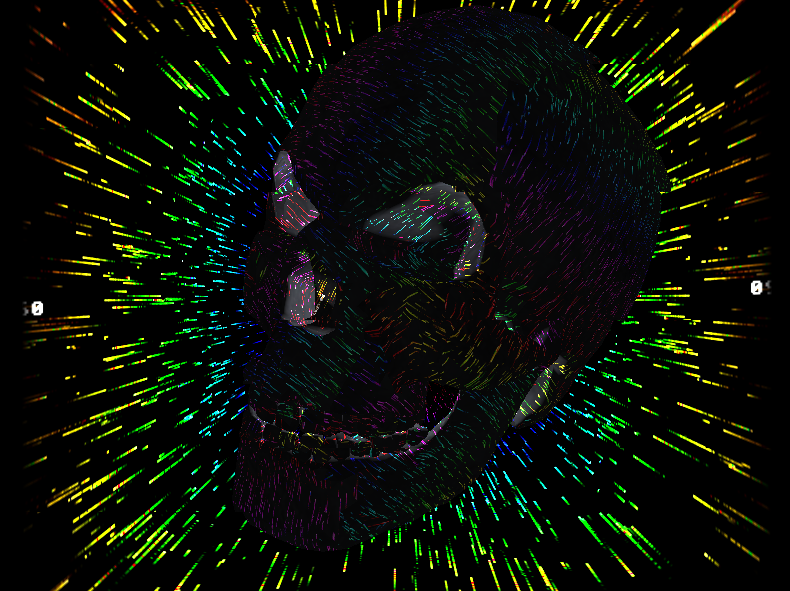

FBGraphics : Custom rendering backend
=====

## OpenGL ES 2.0

FBG OpenGL ES 2.0 rendering backend with GL utilities, similar to the GLFW backend.

Support rendering through fbdev (tested on Nano PI Fire 3 board) and / or dispmanx on Raspberry PI.

### Compiling

See examples `makefile` `rpies2` / `fbdeves2` rule to compile

On Raspberry PI you must define `FBG_RPI` when compiling, this will enable the use of dispmanx which has some advantages over fbdev.

### Examples

See `opengl_es2_example.c`

See `opengl_es2_parallel.c`

## dispmanx

FBG dispmanx double buffering rendering backend, allow fast blitting of the software buffers on Video Core IV GPU (as used in Raspberry PI)

Note : All drawing is still done in software, dispmanx is just used for fast CPU -> GPU buffer transfer aka blitting... the single core example run at full fps at 1920x1080.

FBG Parallelism is trickier because FBG mix the fragments buffer on the main CPU and at 1080p with 3 threads there is alot of pixels to mix... the example still run at 8 fps at 1920x1080 (and 30 fps at 720p) with 3 threads by doing the compositing on dispmanx, without dispmanx compositing the example run at around 2 fps at 1080p.

Because of that an example using pthread parallelism is available see `dispmanx_pure_parallel.c`, each threads are tasked to push specific pixels, it doesn't need to mix buffers, it only use a pthread barrier to keep everything in sync. It run at 20 fps @ 1080p doing a fullscreen colored clear, 50 fps @ 1080p without barrier and 60 fps @ 720p with alot of room to play with pixels. (so 720p is probably the best resolution for this)

Note : This example may have some room for optimizations, especially in respect to RPI CPU caches so i guess bit more FPS could be gained!

### Compiling

See examples `makefile` `dispman` rule to compile

### Examples

See `dispmanx_example.c`

See `dispmanx_pure_parallel.c`

See `dispmanx_parallel.c`

## GLFW

FBG OpenGL 3.x+ rendering backend with GL utilities, multi-platform, use the [GLFW](https://www.glfw.org/) and [GLEW](http://glew.sourceforge.net/) library.

**How it work** : An OpenGL texture is updated in real-time with a FB Graphics context content, as such all FB Graphics draw calls work but are handled by the CPU and the resulting frame buffer is handled by the GPU, you are free to call any OpenGL calls and mix software rendered graphics with accelerated graphics.

It is also possible to modify the way the FBG display buffer is rendered through a shader, see the advanced example where the software rendered background is actually the FBG buffer with a fragment shader applied to it.

### Documentation

See the FB Graphics documentation.

### Lua example

The Lua example is an advanced sample which use the [Lua](https://www.lua.org/) scripting language (through [LuaJIT](http://luajit.org/)) to provide a sort of multithreaded Processing-like (much much less featured) environment with JIT to build FB Graphics graphical sketches from a Lua script without the need to compile any C code.

This use 8 cores, all threads (FBG fragments) have their own Lua state and call the Lua draw() function at each frames.

See `sketch.lua` and `glfw_lua.c`

It require the LuaJIT library.

### Basic usage 

Just call `fbg_glfwSetup` then any FB Graphics calls can be used.

`fbg_glfwClear` can also be useful (a wrapper to glClear)

`fbg_glfwShouldClose` can be used to know when the user close the window.

### Advanced usage

This backend has a lightweight OpenGL library which ease some of the most cumbersome things when starting OpenGL projects such as VBO/VAO/FBO creations, shaders loading (from files or strings), textures creation from FBG images, etc.

It also has built-in OpenGL debugging when `DEBUG` is defined.

The `glfw_example_advanced.c` demonstrate nearly all features and mix 2D graphics (FBG) with 3D graphics.




### Simple example

Draw a red rectangle (handled by CPU) bouncing off the screen borders, see `glfw_example` and its `makefile`:

```c
#include <sys/stat.h>
#include <signal.h>
#include <stdlib.h>
#include <math.h>

#include "glfw/fbg_glfw.h"

int keep_running = 1;

void int_handler(int dummy) {
    keep_running = 0;
}

int main(int argc, char* argv[]) {
    struct _fbg *fbg = fbg_glfwSetup(800, 600, "glfw example", 0, 0);
    if (fbg == NULL) {
        return 0;
    }

    float x = 0, y = 0, velx = 3.4, vely = 3.425;

    signal(SIGINT, int_handler);

    do {
        fbg_glfwClear();
        
        fbg_clear(fbg, 0);
        fbg_draw(fbg);

        fbg_rect(fbg, x, y, 40, 40, 255, 0, 0);

        fbg_flip(fbg);

        x += velx;
        y += vely;

        if (x <= 0 || x > fbg->width - 40) {
            velx = -velx;
        }

        if (y <= 0 || y > fbg->height - 40) {
            vely = -vely;
        }
    } while (keep_running && !fbg_glfwShouldClose(fbg));

    fbg_close(fbg);
}
```

